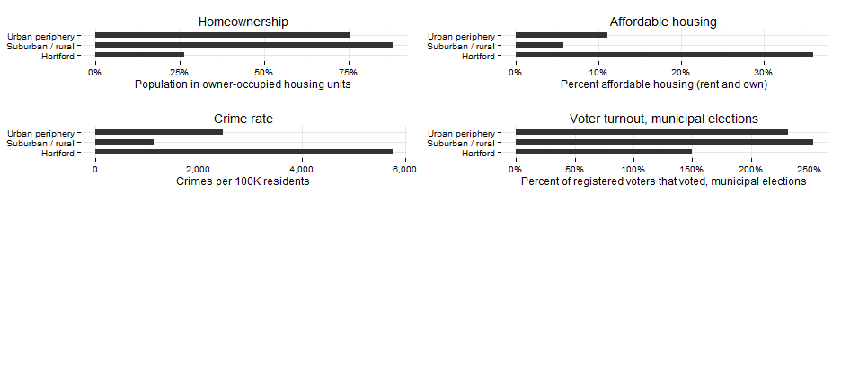

## Key themes

1. 'We are a region'
2. Concentration of poverty in Hartford
3. Suburbanization of poverty
4. Aging population and workforce
5. Globally connected region
6. Achievement gap and talent pipeline
7. Creating opportunity in communities throughout the region

---

## Defining the region: Hartford + surrounding towns

CRCOG region. Based on characteristics of each town, using UConn categories from [5 CTs report](http://ctsdc.uconn.edu/projections/5cts.html), with slight updates. 

 


---
## Low population growth

Low population growth overall; losing population in center city, slow outside, most rapid in outer suburbs. Not great at attracting people to the region. 

 


--- 
## Suburbanization of poverty

New poverty will occur in suburbs, new challenges towns can't ignore. 

 


---
## Aging population

Suburbs are aging quickly and not good prospects for replacing with younger generation, based on current projections. 

 


--- 
## School enrollment declining

Aging population reflected in overall declining school enrollment. Local schools hit twice - once with demographics, again through increase in magnet / private enrollment.

 

```
## Error: object 'otm' not found
```


--- 
## Linguistic diversity

Diversity part of changing population (tie back to 1st chart); which suburbs will 'globalize'? Where will new population in our region come from? (Add refugee factoid.)

 


--- 
## Everyone commutes, mostly to Hartford

Globally connected city via employers as well. Draws high-skill jobs to the region, so people commute to the job centers (Hartford and some other towns).


--- 
## Demand for a skilled workforce

Commuting and the next 2 slides together, making the case that region has high skilled jobs as an asset, but skills not equitably distributed in the workforce. 

 


--- 
## Job growth

And job growth in historically strong sectors (finance & insurance, manufacturing) has not been strong recently. Changes in job market - strengths are strengths no longer. 

 


--- 
## Talent pipeline from schools

Where is future workforce? Don't know what future jobs will be, but best strategy is to have an educated population. High skills jobs (college+) will be most in demand.

 


--- 
## Achievement gap starts early

And can start addressing gaps in education early on, including even earlier in early childhood. 

 


--- 
## What makes a vibrant community?

Creating opportunity in the region, what makes 'vibrant communities'? Knit together four slides with maps of region for homeownership, crime, affordable housing and voting. 

 


--- 
## Affordable housing

Part of creating opportunity outside areas of concentrated poverty. 

 


--- 
## Hartford getting safer

Choice in housing based on factors like schools and safety. Doing better but still understandable that those who can afford to live in low-crime towns. 

 


--- 
## Voter turnout another measure of civic health

With with housing, crime. Add in factoid about diversity of gov't officials representing electorate (Hartford / region are among the worst nationally).

 


