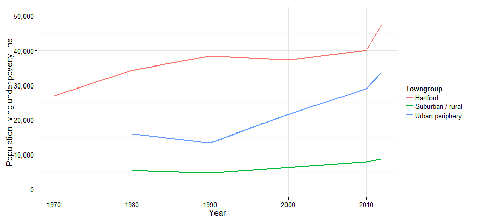
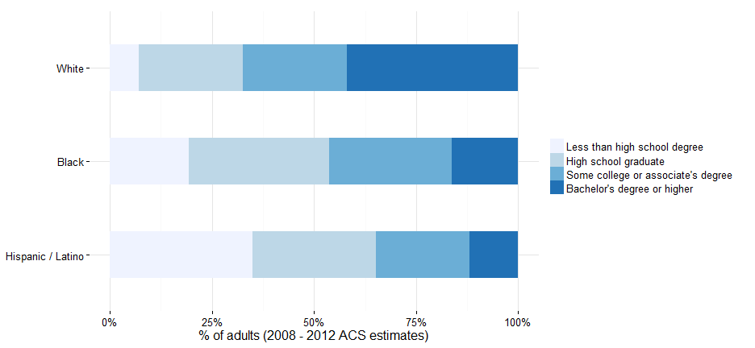
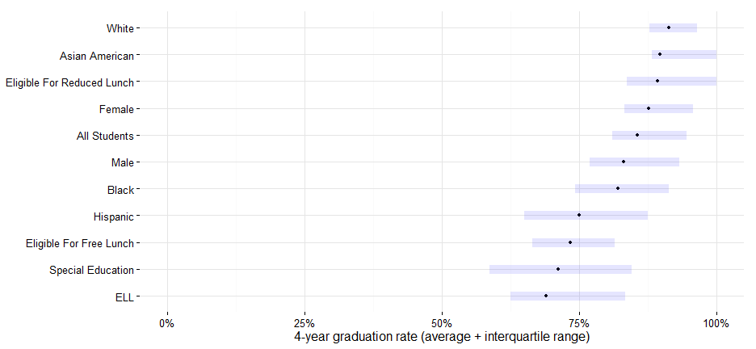
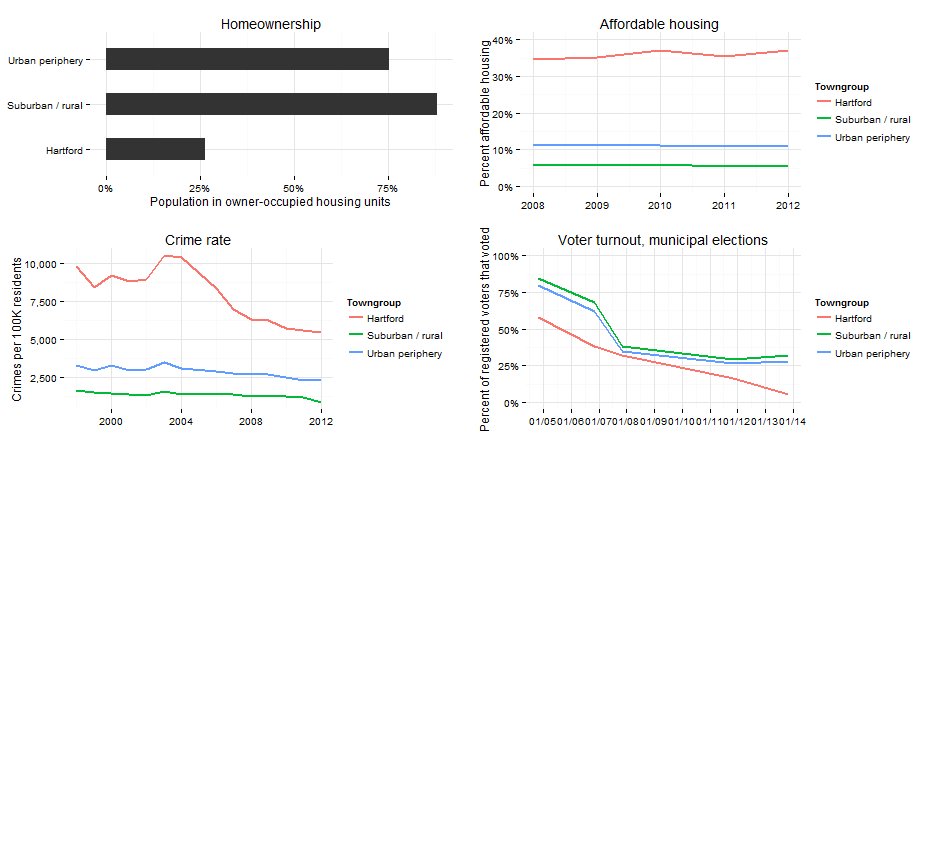

## Key themes

1. Regionalism
2. Suburbanization of poverty
3. Concentration of poverty in Hartford
4. Achievement gap
5. Middle skills gap
6. Aging workforce
7. Civic health
8. Global region

---
## Flat population growth

Themes: regionalism, suburbanization of poverty  
Key points: population loss in Hartford, flat population growth in suburbs

 
 

---
## Aging population (?)

Themes: regionalism, aging workforce  
Key points: aging population in suburbs, talent pipeline from Hartford

 

--- 
## Linguistic diversity

Themes: Global region, achievement gap, suburbanization of poverty   
Key points: Suburbs more diverse, ELL students in public school systems.

 

--- 
## School choice unique to region

Themes: Regionalism, disparities  
Key points: Integration through school system, districts not the same as towns.

 

--- 
## Everyone commutes, mostly to Hartford

Themes: Regionalism, background for aging workforce  
Key points: Every town sends workers to Hartford; job center

--- 
## Suburbanization of poverty

Themes: suburbanization of poverty  
Key points: Poverty growing fastest in suburbs

 

--- 
## Income inequality

Themes: suburbanization, concentration of poverty  
Key points: Affluent suburbs, inner-ring suburbs have many low-income neighborhoods

 

--- 
## Achievement gap starts early

Themes: Achievement gap, global region  
Key points: Everybody improving, but gaps remain for subgroups

 

--- 
## Chronic absenteeism an early warning sign

Themes: Suburbanization of poverty  
Key points: Some rural districts with high rates, otherwise same as others

 

--- 
## High-school graduation rising, but with gaps

Themes: Achievement gap, middle skills gap  
Key points: HS graduates are talent pipeline, need to address disparities

 

--- 
## Skilled workforce now, but need to look ahead

Themes: Middle skills jobs, Achievement gap  
Key points: Connect workforce to schools, aging workforce

 

--- 
## Jobs (key sectors > 20K employees in region)

Themes: Middle skills jobs, aging workforce  
Key points: Eroding regional strengths in finance and manufacturing, growth in healthcare

 

--- 
## Manufacturing jobs (> 50 establishments)

Themes: Middle skills jobs, aging workforce  
Key points: Which manufacturing businesses are growing in the region?

 

--- 
## Youth unemployment highest

Themes: Aging workforce, middle skills gap  
Key points: 16 to 24 cohort are opportunity youth, future workforce

 

--- 
## Home ownership sign of civic health (replace w/ map)

Themes: Civic health, concentration of poverty  
Key points: Housing market divided, higher mobility in Hartford

 

--- 
## Affordable housing

Themes: Concentration of poverty  
Key points: Affordable housing limited to few towns

 

--- 
## Hartford safest in 30 years

Themes: Civic health  
Key points: Progress on reducing crime, perception v. reality

 

--- 
## Voter turnout another measure of civic health

Themes: Civic health  
Key points: Connect to home-ownership

 

